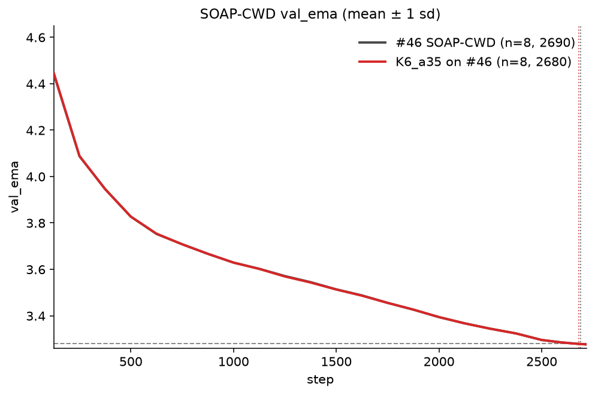
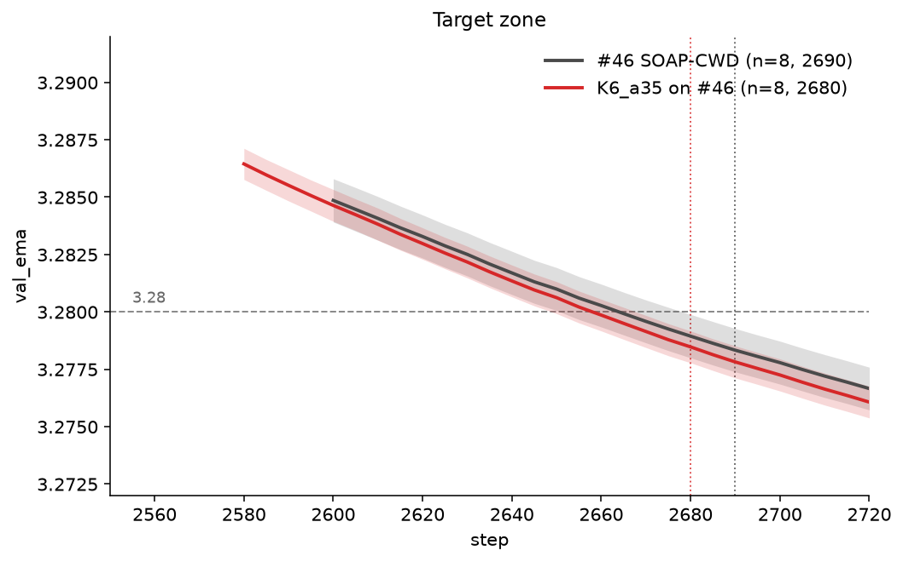

# Record: Track 3 Optimization — frozen K-Maxwell on SOAP-CWD — 2680 steps (n=8)

Collaborator: [Jeffrey Cheng](https://github.com/jeffreyscheng)([@jeffreyscheng](https://github.com/jeffreyscheng))

## Summary

This record applies a **frozen** K-Maxwell mix to record **#46**
([PR #328](https://github.com/KellerJordan/modded-nanogpt/pull/328))'s SOAP-Muon
+ Tail-EMA + RowFloor + CWD trainer. The only training change is the first-moment
memory: at step 1000, Muon's single EMA becomes a mixture of six log-spaced EMAs
with a **fixed** mean gradient age of 35 steps.

Across eight seeds the Track 3 statistic first passes at **2680 steps**, 10 steps
earlier than #46's 2690-step record:

```text
mean val_ema at 2680 = 3.27847
(3.28 - mean) * sqrt(8) = 0.00432 >= 0.004
```

That is a thin win. It is **not pairwise significant** versus #46 at equal step
(2690: `0.00102 < 0.004`). More importantly,
[PR #339](https://github.com/KellerJordan/modded-nanogpt/pull/339)'s bi-Maxwell
kernel on this same stack is **better**: 2635 steps (n=8, A800), and a same-hardware
H100 n=8 reproduction of #339 first-passes at **2640** and beats this kernel
pairwise. If #339 merges, this 2680 recipe is behind it.

Annealing the mix — the lever that won on tuned Muon
([PR #357](https://github.com/KellerJordan/modded-nanogpt/pull/357)) and MuonH
([PR #359](https://github.com/KellerJordan/modded-nanogpt/pull/359)) — **does not
help** here. Tail-EMA already averages the cooldown tail, and old→young annealing
regresses.

## Method

For each Muon matrix parameter:

```python
# step > 1000; the switch step itself is baseline-identical
for k, beta in enumerate(kmaxwell_decay_rates):  # six log-spaced ages in [3, 56]
    m[k].lerp_(g, 1 - beta)
m_eff = sum(w[k] * m[k] for k in range(6))       # frozen mix, mean age 35
update = g.lerp(m_eff, 0.95)                     # then SOAP / NS / RowFloor / CWD
```

At the switch, all six buffers lazy-initialize from the just-advanced single-EMA
momentum. The switch-step update is therefore identical to the baseline. SOAP
still sees the **raw** gradient. Newton–Schulz, RowFloor, post-pin CWD, Tail-EMA
readout, radius pin, EMA-Nesterov, and the #46 schedule are unchanged.

## Why annealing failed on this stack

K-Maxwell first worked on a conventional tuned-Muon baseline by annealing from
older to younger gradient memory. The same schedule also transferred to MuonH.
On this SOAP-CWD stack the search stayed small for that reason: we brought over
the frozen `K=6`, τ ∈ `[3, 56]`, mean-age-35 mix, then checked whether the Muon
annealing schedule helped.

It did not. Tail-EMA (`τ=150`, `λ=0.6` over `[2400, 2900]`) already supplies a
slow average of the cooldown. Adding a second, time-varying memory on the
optimizer first moment is redundant and hurts validation loss. The two-timescale
**bi-Maxwell** kernel in [PR #339](https://github.com/KellerJordan/modded-nanogpt/pull/339)
— a frozen mix of ages ~6 and ~49 with mean age ~30 — is the better memory shape
for this stack.

This is the counterexample to treating K-Maxwell annealing as a universal
optimizer upgrade. Temporal memory shaping is stack-dependent.

## Configuration

| field                  | value                                          |
| ---------------------- | ---------------------------------------------- |
| K / EMA mean-age range | `6` / `[3, 56]`                                |
| mixture                | frozen mean age `35` (no anneal)               |
| K-Maxwell start        | step `1000` (lazy-init identity)               |
| Nesterov coefficient   | `0.95`                                         |
| SOAP / RowFloor / CWD  | unchanged from #46                             |
| Tail-EMA               | `τ=150`, `λ=0.6`, `[2400, 2900]`               |
| training steps         | `2900` schedule; runs stopped at `2720`        |

## Result

**8×H100, n = 8 seeds (0–7).** Reported with the Tail-EMA readout (`val_ema`),
the readout this configuration ships. Dense eval every five steps over
`[2580, 2720]`. Per-seed first val_ema crossings of 3.28:
`[2655, 2660, 2660, 2660, 2675, 2645, 2675, 2655]` (mean 2661).

| seed                 | step 2675       | step **2680**   | step 2685       | step 2690       |
| -------------------- | --------------- | --------------- | --------------- | --------------- |
| 0                    | 3.27850         | 3.27818         | 3.27786         | 3.27753         |
| 1                    | 3.27892         | 3.27865         | 3.27828         | 3.27796         |
| 2                    | 3.27868         | 3.27837         | 3.27804         | 3.27771         |
| 3                    | 3.27866         | 3.27832         | 3.27798         | 3.27768         |
| 4                    | 3.27981         | 3.27948         | 3.27915         | 3.27884         |
| 5                    | 3.27780         | 3.27749         | 3.27715         | 3.27684         |
| 6                    | 3.27974         | 3.27941         | 3.27906         | 3.27877         |
| 7                    | 3.27819         | 3.27788         | 3.27755         | 3.27721         |
| **mean**             | **3.27879**     | **3.27847**     | **3.27813**     | **3.27782**     |
| **(3.28 − mean)·√8** | **0.00343 (✗)** | **0.00432 (✓)** | **0.00528 (✓)** | **0.00617 (✓)** |

- Candidate first statsig-passing boundary: **2680**, margin `0.00432`.
- Versus published #46 at equal step 2690 (mean `3.278329`): pairwise statistic
  `0.00102 < 0.004` — **not pairwise**. Hardware is also unmatched (#46 is 2×A40).
- Versus [PR #339](https://github.com/KellerJordan/modded-nanogpt/pull/339)
  (2635, A800 mean `3.27852`): #339 is the better memory kernel on this stack.

## Visualizations

### Loss curves and the formal crossing

The full curve shows the n=8 K-Maxwell `val_ema` trajectory against the published
#46 A40 n=8 fleet.



The target-zone view marks this record's first n=8 formal pass at step 2680 and
#46's official n=8 passing checkpoint at step 2690.



## Reproducing

The winning schedule and K-Maxwell recipe are defaults; only the seed varies.
`STOP_STEP=2720` drops the unused `[2721, 2900]` tail (prefix-identical to a
full run):

```bash
STOP_STEP=2720 torchrun --standalone --nproc_per_node=8 \
    records/track_3_optimization/results/20260824_kmaxwell_2680/train_gpt_cwd_kmaxwell.py \
    --seed 0
```

## Files

- `train_gpt_cwd_kmaxwell.py` — #46 trainer plus the frozen K=6 mix.
- `summary.tsv` — n=8 `val_ema` values and statistical summary.
- `H100_seed{0..7}.txt` — raw runs for the winning K=6 configuration.
- `figure.png` — K-Maxwell trajectory versus the published #46 fleet.
- `zoomed_figure.png` — both records' formal passing checkpoints.

## Acknowledgements

Thank you to [Jerry Hong](https://github.com/jerryhong21)
([@jerryhong21](https://github.com/jerryhong21)) for assisting with this project.

The SOAP-CWD + Tail-EMA baseline is record #46,
[PR #328](https://github.com/KellerJordan/modded-nanogpt/pull/328) by
[@ypwang61](https://github.com/ypwang61). The better memory kernel on this stack
is the bi-Maxwell result in
[PR #339](https://github.com/KellerJordan/modded-nanogpt/pull/339) by
[@orange4664](https://github.com/orange4664).
